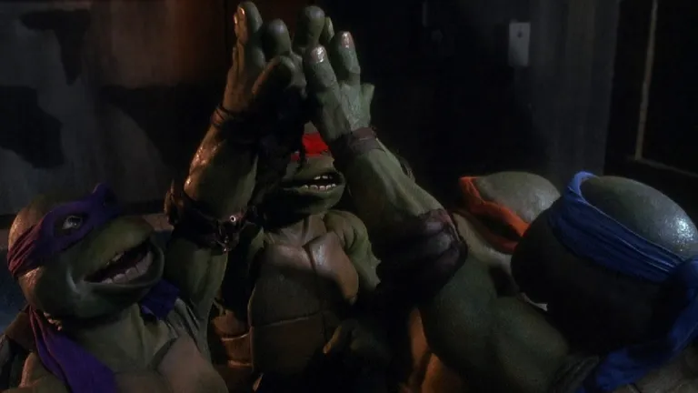

# Ooze



A zero dependency tiling terminal emulator in progress that can be extended with UI plugins (Ruby). 

Based on the same idea from [Krang](https://github.com/skinnyjames/krang) but approached from scratch according to spec without an LLM.

## Similarities to Krang

The value proposition is the same. 

> I wanted to make something to prove the viability of writing efficient and interesting desktop applications with hokusai-pocket

In [hokusai-pocket](https://github.com/skinnyjames/ooze), a gui is evaluated at runtime, which has implications on scriptability of desktop programs. see [docs](https://hokusai.skinnyjames.net).

The GUI will load Ruby plugins at runtime.
Plugins are defined as subclasses of `Hokusai::Block` and can register under keyword that can be invoked with a special shell script: `oz`

In the terminal PTY, when a user types something like
```bash
ls *.png | oz img | xargs rm
```
The `oz` shell script sends an ANSI OSC sequence to the GUI, which looks for a plugin registered to img. If it exists, the plugin is mounted and its on_ready method will be invoked with the calling directory, the payload argument, and a block callback for returning a reply.


## Differences from Krang

Krang was generated with the help of an LLM to prove out the idea using hokusai-pocket.  Ooze will be LLM free.

One of the design goals of this project is to expose VT100/200 behaviors in a more readable / understandable way.  This project also allows for UTF-8 in printed content, OSC (_Operating System Command_) strings and, DCS (_Device Control String_) passthroughs.  

There is a test suite that will work through the terminal logic without needing a PTY.

I'm dropping Windows support from this project because I will not be bothered to spend a lot of time learning ConPTY idiosyncrasies.  If you want Windows support, use [Krang](https://github.com/skinnyjames/krang)

* UTF-8 Support
* Reference implementation
* No windows support

## License

Chill, daddy.  We'll get there.


